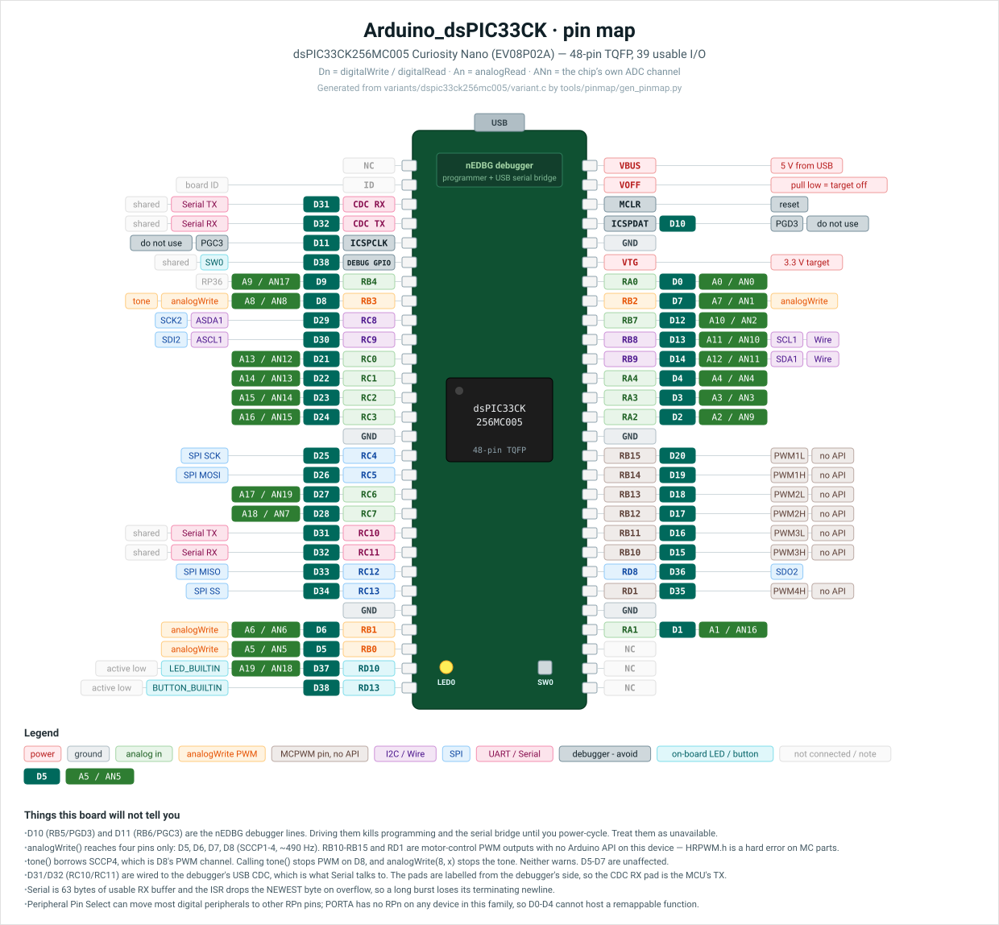

# Arduino_dsPIC33CK

Arduino platform for Microchip dsPIC33CK family DSCs. Install it from the Arduino
IDE Boards Manager, select a board, and upload — the usual Arduino workflow, on
dsPIC silicon.

**Windows only.** The build and upload wrappers are `.bat` files; see
[Platform support](#platform-support).

## Installation

1. In Arduino IDE, open **File → Preferences → Additional Boards Manager URLs**
   and add:

   ```
   https://github.com/9Nicotin/Arduino_dsPIC33CK/releases/latest/download/package_microchip_dspic33ck_index.json
   ```

2. Open **Tools → Board → Boards Manager**, search for **dsPIC33CK**, and click
   **Install**.

3. Select your board under **Tools → Board → Arduino_dsPIC33CK**.

You also need two Microchip tools installed, because their licences do not permit
redistribution — they cannot ship inside the platform:

| Prerequisite | Needed for | Notes |
|---|---|---|
| [XC-DSC compiler v4.00+](https://www.microchip.com/xc-dsc) | compiling | v4.00 is the first with C++ (`xc-dsc-g++`), which this core requires. The free edition is enough. |
| [MPLAB X IDE](https://www.microchip.com/mplabx) | uploading via PICkit/SNAP/nEDBG | Not needed if you only compile. Needed **once** to burn the serial bootloader, after which dsPIC33CK256MC005 uploads over the UART without it — see [Uploading over the serial bootloader](#uploading-over-the-serial-bootloader). |

Both are found automatically at the moment they are used, including picking the
newest of several installed versions, so there is nothing to configure. If you
installed either somewhere unusual, see
[Overriding tool paths](arduino-platform/README.md#overriding-tool-paths).

The Device Family Packs *are* redistributable (Apache-2.0), so the Boards Manager
installs them for you, pruned to the supported devices.

## Supported Boards

| Device | Package | Board | Notes |
|--------|---------|-------|-------|
| dsPIC33CK256MC005 | 48-pin TQFP | [EV08P02A Curiosity Nano](https://www.microchip.com/en-us/development-tool/EV08P02A) | Hardware-verified; onboard nEDBG debugger |
| dsPIC33CK256MP508 | 80-pin TQFP | Curiosity DM330030 | |
| dsPIC33CK256MC002 | 28-pin SDIP | Custom | |
| dsPIC33CK32MP102 | 28-pin SDIP | Custom | |

## Pin map — dsPIC33CK256MC005 Curiosity Nano (EV08P02A)

Arduino pin numbers next to the pad labels silkscreened on the board, so you can
go from a header pad to the number `digitalWrite()` wants without a datasheet.

[](docs/img/pinmap-dspic33ck256mc005.svg)

`Dn` is the digital pin number, `An` the `analogRead()` name, and `ANn` the chip's
own ADC channel — printed because the two do **not** line up (`A9` is `AN17`).
The diagram is drawn by [tools/pinmap/gen_pinmap.py](tools/pinmap/gen_pinmap.py),
whose pad tables are checked against
[variant.c](arduino-platform/microchip/dspic33ck/variants/dspic33ck256mc005/variant.c)
and `pins_arduino.h` by
[tools/pinmap/check_pinmap.py](tools/pinmap/check_pinmap.py) — port, bit, ADC
channel and `An` name on all 39 pins — so a pad that disagrees with what the core
compiles is a build failure rather than a wrong picture. Pad order is from Figure
1-1 of the [board user guide](https://www.microchip.com/en-us/development-tool/EV08P02A)
(DS70005656).

Physical package pin numbers are deliberately **not** on the diagram. Pads are
identified the two ways this repo can actually verify — the port name the board
silkscreens, and the Arduino number your sketch uses. A package number printed
beside `RP58` invites someone to count pins on the chip, and the DFP's own device
description turns out not to be a trustworthy source for it: two 28-pin parts in
this family list their pins in the same cyclic order offset by four, so at most
one of the two starts at pin 1 and nothing in the pack says which. For a bare
chip on your own board, use the data sheet for your package.

Six things the board will not tell you, all of which will cost you an evening:

- **D10 and D11 belong to the debugger.** `RB5`/`PGD3` and `RB6`/`PGC3` are the
  nEDBG programming lines. Driving them kills programming *and* the serial bridge
  until you power-cycle. Treat them as unavailable.
- **`analogWrite()` reaches four pins: D5, D6, D7, D8** (SCCP1–4, ~490 Hz).
  `RB10`–`RB15` and `RD1` are motor-control PWM outputs in silicon, but no Arduino
  API reaches them on this device — `HRPWM.h` is a hard error on MC parts, which
  have no auxiliary PLL.
- **`tone()` borrows SCCP4, which is D8's PWM channel.** `tone()` stops PWM on D8;
  `analogWrite(8, x)` stops the tone. Neither warns. D5–D7 are unaffected.
- **The CDC pad labels are from the debugger's side.** D31/D32 (`RC10`/`RC11`) are
  the USB serial bridge that `Serial` talks to, so the pad marked *CDC RX* is the
  MCU's **TX**.
- **`Serial` has 63 usable RX bytes** and the ISR drops the *newest* byte on
  overflow, so a long burst loses its terminating newline rather than its head.
- **Peripheral Pin Select cannot reach PORTA.** No device in this family has an
  `RPn` on PORTA, so D0–D4 can never host a remappable peripheral.

## Features

- Arduino API: `pinMode`, `digitalWrite`, `analogRead`/`analogWrite`, `Serial`,
  `millis`, `micros`, `delay`, `tone`, `attachInterrupt`, `shiftIn`/`shiftOut`,
  `pulseIn`, `map`
- C++ throughout (XC-DSC v4.00): classes, templates, overloading, and
  `Serial.println()` dot notation
- Libraries: SPI, Wire, HRPWM (500 MHz high-resolution PWM, 250 ps edge placement)
- PWM: ~490 Hz via SCCP modules, with automatic prescaler selection
- 27 examples. 26 under **File → Examples → Arduino_dsPIC33CK**: `01.Basics`
  (Blink, AnalogReadSerial), `02.CppFeatures` (CppDemo), `03.PWM` (Fade, PWMTest),
  and 21 sketches in `04.CuriosityNano` written for the EV08P02A — covering GPIO,
  ADC, DAC, comparator, PWM, tone, interrupts, `millis`, watchdog, shift
  registers, stepper drive, sine synthesis, I2C, SPI and serial commands. The
  27th, BoostMPPT, is under **File → Examples → HRPWM** because it ships with
  that library, and needs an MP-series part (see [Pin map](#pin-map--dspic33ck256mc005-curiosity-nano-ev08p02a)).

## Uploading over the serial bootloader

**dsPIC33CK256MC005 only.** Normally every upload goes through a debugger, which
makes MPLAB X a prerequisite for blinking an LED and leaves a custom dsPIC33CK
board with nothing but a UART unprogrammable from the IDE. The serial bootloader
removes that: after burning it once, uploads go over the same COM port the Serial
Monitor uses.

1. Select the board, then pick whichever programmer you own under
   **Tools → Programmer** — *PICkit 5*, *PICkit 4*, *MPLAB SNAP*, *PKOB4* and
   *nEDBG* all work — and run **Tools → Burn Bootloader**. (Don't pick
   *Serial Bootloader (UART)*; it can't install itself.) This needs MPLAB X, and it
   is the only time you will need it.
2. Set **Tools → Bootloader → Serial (UART, 115200)**.
3. Press **Upload**, as usual.

That is all. No button to hold, no reset to time — a running sketch is asked to
reset itself, so uploading feels exactly like uploading to an Arduino.

Four things to know:

- **Programming with a debugger erases the bootloader.** `ipecmd` erases the whole
  device, so any upload through nEDBG/PICkit/SNAP — including
  **Sketch → Upload Using Programmer** — wipes it and you must burn it again.
  Switch **Bootloader** back to *None* when you go back to the debugger.
- **The bootloader costs flash twice:** 0x1800 words it reserves for itself, and
  1608 bytes of interrupt-forwarding table in every sketch. The size bar accounts
  for both, and the limit drops from 262144 to 246784 bytes.
- **Soft entry needs a cooperating sketch, and `NanoBlink` is not one.** Entry works
  by asking the *running* sketch to reset itself, so a sketch that never calls
  `Serial.begin()` — or that sits with interrupts disabled — blocks the next serial
  upload. On a Curiosity Nano, **Tools → Burn Bootloader** clears the sketch and
  leaves the board waiting in the bootloader, with no hands on the hardware; on a
  board with no debugger, hold **SW0** through a power cycle. Putting
  `Serial.begin(115200);` in `setup()` avoids it, and every `04.CuriosityNANO`
  example except `NanoBlink` already does.
- **An interrupted upload is not a brick.** The image is only marked valid after
  every word has been verified, so pulling the cable mid-transfer leaves the board
  in the bootloader, waiting — recoverable over serial alone, with no debugger.

The bootloader's own C sources ship in the platform under
`bootloaders/dspic33ck256mc005/`, next to the `.hex` that is flashed, so nothing
about what runs on your board is opaque.

**[Part 6: Serial Bootloader](arduino-platform/docs/part6_serial_bootloader.html)**
is the full guide — three ways to burn it (IDE, command line, MPLAB IPE), the memory
map, how interrupts are forwarded, troubleshooting, recovery, replacing the on-board
debugger with a plain USB-serial adapter, and what it takes to put this bootloader on
your own hardware.

**[Part 7: Bench Verification](arduino-platform/docs/part7_bench_verification.html)**
is the procedure to run once on a real board: nine steps from burning the bootloader to
deliberately interrupting an upload, the two numbers to read off a compile, and a section
on what the procedure does *not* prove.

## Platform support

Windows only, and deliberately so rather than by omission: every compile and
upload goes through a `.bat` wrapper that locates the XC-DSC compiler and MPLAB X
at the moment of use. XC-DSC itself ships for Linux and macOS, so a port is a
matter of transliterating those wrappers to shell scripts and adding
`.linux`/`.macosx` recipe keys — the TODO markers are in `platform.txt`. Until
then the package index advertises Windows only, so a Linux or macOS user sees a
clear "not available for your OS" instead of an install that half-works.

## Developing this platform

Contributors need one extra step, because the Boards Manager can only install
*released* archives and never your working tree:

```
arduino-platform\install_arduino_ide.bat
```

This copies `arduino-platform/microchip/dspic33ck/` over the installed platform
and checks your prerequisites. Re-run it after every source change — the IDE
compiles what is in `%LOCALAPPDATA%\Arduino15`, not what is in this repo.

To cut a release, see [tools/release/make-release.sh](tools/release/make-release.sh),
which builds the three archives, computes their checksums, and fills them into
`arduino-platform/package_microchip_dspic33ck_index.json`.

## Structure

| Path | Purpose |
|------|---------|
| arduino-platform/ | Arduino IDE platform (cores, variants, libraries, tools) |
| arduino-platform/package_microchip_dspic33ck_index.json | Boards Manager package index (source of truth) |
| arduino-platform/install_arduino_ide.bat | Developer install of the working tree |
| tools/release/ | Release archive + checksum + index generator |
| tools/pinmap/ | Generates the pin-map SVG from `variant.c` |
| cmake/ | CMake build files (for MPLAB X compatibility) |
| docs/ | HTML documentation |
| docs/img/ | Generated diagrams used by this README |
| test_led/ | Early hardware test sketches |
